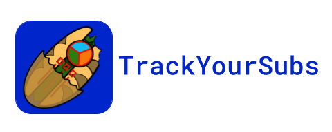
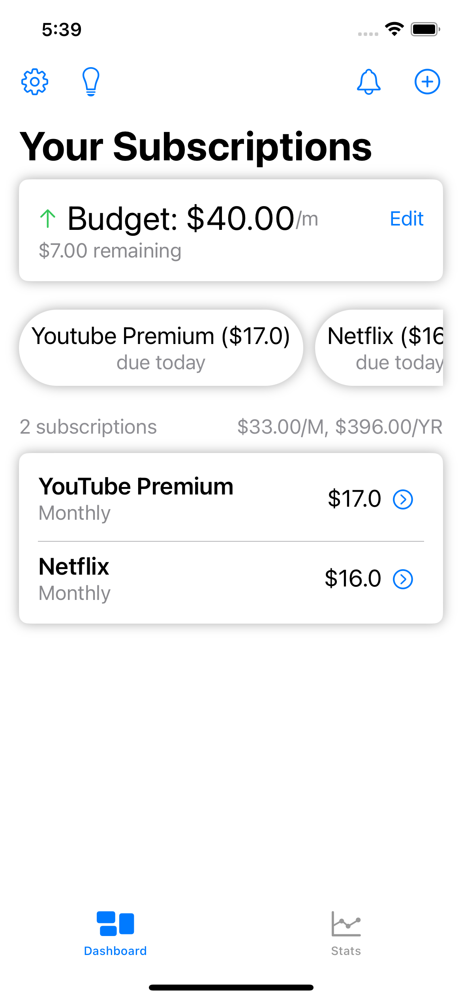
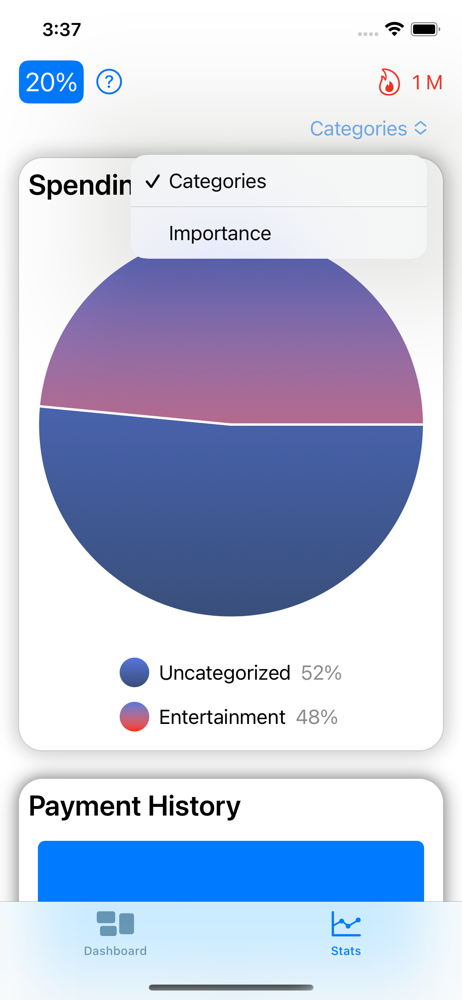

## 👀 At a glance...
An IOS app to track you subscriptions and expenses, all the while presenting in a clean and professional look with a load of features. Some of the more evident features are:
* Budgeting (monthly / yearly option available)
* Current monthly & yearly total expense at a glance
* Custom suggestions to meet budget
* Organize (Categorization & Importance), order, & filter through subscriptions
* Reminders via scheduled notifications
* Track payments over time 
* Stats page: pie chart visual, bar chart visual, and streak indicator
* Get up-to-date prices on subscritions with a press of a button **(Beta)**

🎥 [Video Demo Here](https://youtu.be/KsTx-F70OOk)

## 🌁 Quick View
<table>
<tr>
  <td></td>
  <td></td>
</tr>
</table>

## 🧾 Where can I get this?
At the moment, the app is not available in the app store. But with further improvement and support it might some day. 🤞 If you feel as though this app should see the light of day, I ask that you please leave a star for this repository. 🙏

## 🔮 Future Implementations
+ Tic Tac Toe monthly timeline in `EditView.swift` to show track record of payments for that subscription.
+ Add streak for each subscription separately.
